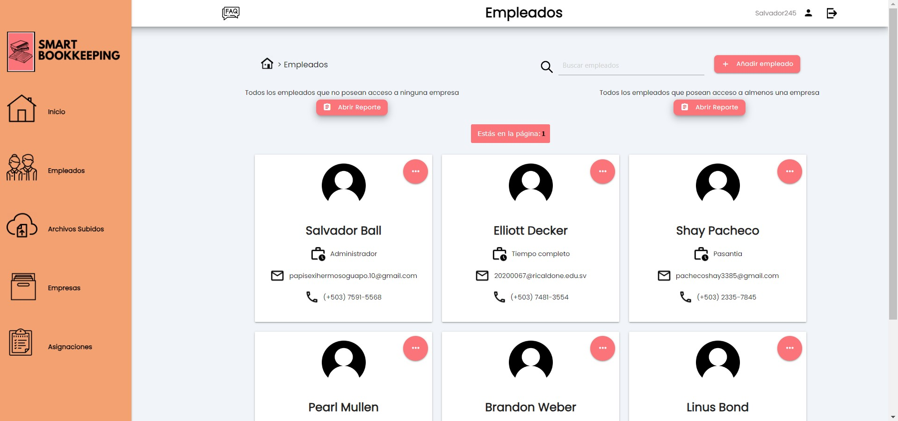

<h1 align="center"><b>Hi, I'm  <a href="https://github.com/DarkKingpro10">Jesús Esquivel</a></b></h1>

<!---->
  
## About me

Nice to meet you, first of all I want to thank you for visiting my Github profile and also for scrolling down 😁. You might be wondering why the profile account is “DarkKingpro10”. Well, that's a funny story, but before I tell you, as you probably know, I'm a Frontend developer but in the future I want to be a FullStack developer, I work on school projects right now, but I'm looking for a job. so when I get it I will change this (Obviously); I want to create more projects for a portfolio in this way. I hope you find an interesting project.

Just to clarify, my full name is Jesús Gerardo Esquivel Ramírez from <strong>El Salvador</strong>,and there are some private projects I'm struggling with so the people who help me let me make them public.

## <b> Skills</b>
* **Front-End Development**:

   
   
   
   
   
   
   
   
   
   
   
* **Software and Tools**:

   
   
   
   
   

* **Databases**:
  
   
   
   
 

  

## *Stronger* Projects
<table>
<tr>
<td width="50%">
<h3 align="center">E-Dream</h3>

E-Dream is a school project built in JAVA swing with SQL Server as a database. The <strong>E-Dream project</strong> is an inventory, employee, sales and order manager. It is basically an all-in-one desktop application, since in a single application you can manage your employees, inventory and sales, and it can be adapted to any company that wants.

                                                                                     
</td>

<td width="50%">
 
<h3 align="center">SmartBookkeeping</h3>

                                       

 

Smart Bookkeeping or SmartBook is an administrative web application designed by students, SmartBook was designed to help companies that manage various files for various companie; The program is designed for any company that wants to manage the various files of various companies by creating users (employees) and assigning them access to the files of the companies that the administrator desires.

                                                             
</table>                                                                                 

</td>

## *Other* Projects
<table>
<tr>
<td width="50%">
<h3 align="center">Echo Flix</h3>

Echo Flix is an application that I was asked to make in record time to be able to have the billboard of recent movies, it is like a Netflix clone but super super, extremely far from a clone. Just taking the idea, but it was good to practice in record time with react and nextJS.

                                                                                     
</td>                                                            
</table>                                                                                 

  

## <b> Github Stats </b>
 

##Finally you discover Why Darkking
>So basically, I create this account as DarkKing because at first time I want to be anonymous and have a personal account, but then my friends start to call me like DarkKing, now thay all are gone, so to remember the good all days, I conserve this account as mine, and the number 10 is for Messi. I hope you didn't scroll down just to find out why.
